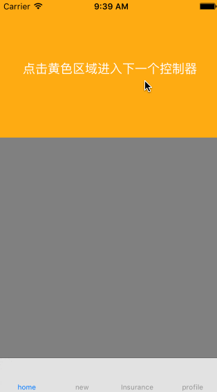

# JYJNavigationBar
  自己的，有什么不足请多多指教哈哈
  

# GIF
 

# Usage
 `JYJNavigationBar` 很简单，只是提供一个思路，大家需要自己集成。滑动返回，用的网上现在非常受欢迎的 `FDFullscreenPopGesture` ，这样就不用自己写代码了
 

```
- (void)scrollViewDidScroll:(UIScrollView *)scrollView {
    if (self.titleName) {
        self.navigationItem.title = @"";
    }
    CGFloat offsetY = scrollView.contentOffset.y;

    if (offsetY > -imageH + startH) {
        CGFloat alpha = MIN(1, 1 - ((-imageH + startH + 64 - offsetY) / 64));
 
        self.navBarView.backgroundColor = BXAlphaColor(253, 171, 47, alpha);
        if (offsetY >= (-imageH + startH + 64)){
            if (self.titleName) {
                self.navigationItem.title = self.titleName;
            }
        }  
    } else {
        self.navBarView.backgroundColor = BXAlphaColor(253, 171, 47, 0);
    }
    
// ------------------------------华丽的分割线------------------------------------
    // 设置头部放大
    // 向下拽了多少距离
    CGFloat down = - imageH - scrollView.contentOffset.y;
    if (down < 0) return;
    
    CGRect frame = self.headerImage.frame;
    frame.origin.y = - imageH - down;
    frame.size.height = imageH + down;
    self.headerImage.frame = frame;
}


```


# 联系我
 QQ 453255376, 希望大家踊跃联系我，把程序写的更好。有更好的想法，有不明白的问我。喜欢的点个星星。
 